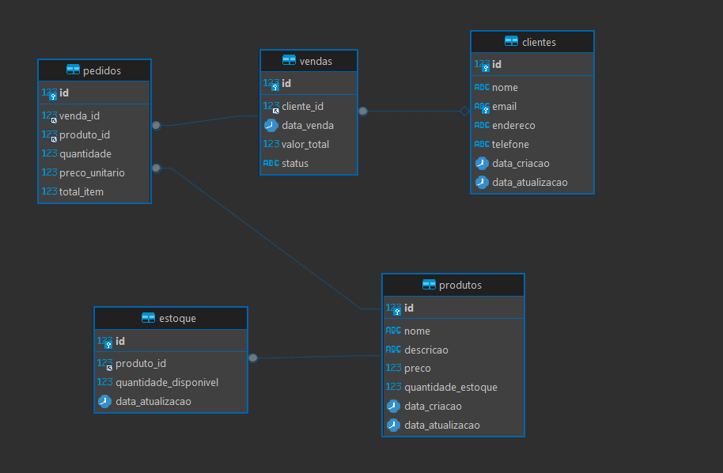
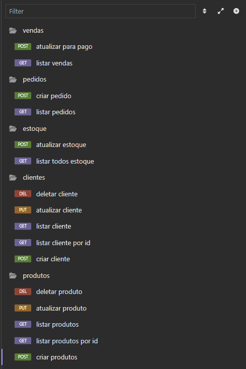

# DNC DESAFIO 6

## Tecnologias e Ferramentas Utilizadas

Este projeto utiliza as seguintes tecnologias e ferramentas:

- **Node.js**: Ambiente de execução JavaScript no lado do servidor.
- **Express**: Framework web para Node.js, utilizado para construir a API REST.
- **DBeaver**: Sistema de gerenciamento de banco de dados relacional.
- **JavaScript**: Linguagem de programação principal utilizada no projeto.
- **Insomnia**: Ferramenta para testar e desenvolver APIs.
- **Git**: Sistema de controle de versão utilizado para gerenciar o código fonte.
- **Google Drive**: Armazenamento de arquivos adicional utilizado para compartilhar documentos.

## Estrutura de Diretórios

- `src/`
  - `assets/`
    - `images/` - Contém imagens utilizadas no projeto.
  - `config/` - Arquivos de configuração.
  - `controllers/` - Controladores para manipular a lógica das rotas.
  - `routes/` - Definições das rotas da API.

## Imagens


- 
- 

## Link Adicional

Você pode acessar este arquivo e baixar para importar as rotas API para o insomnia [Arquivo Google Drive](https://drive.google.com/file/d/1YF4xEel7i39s-yJgCtP12LiixA7V-Mmw/view?usp=sharing)

## Contribuição

Se você deseja contribuir para este projeto, siga os seguintes passos:

1. Faça um fork do repositório.
2. Crie uma nova branch para suas alterações:
   ```bash
   git checkout -b minha-nova-branch